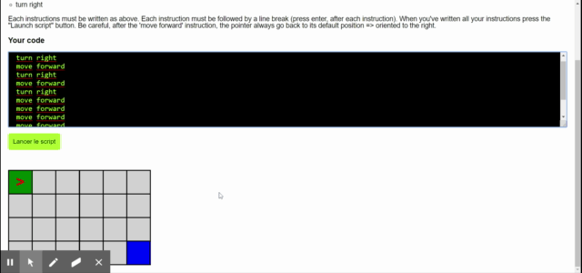

# JSGame

## Instruction to play Decomposer

Your goal is to go from the green cell to the blue one. 
You can use 3 instructions :
- move forward
- turn left
- turn right

Each instructions must be written as above. Each instruction must be followed by a line break (press enter, after each instruction). When you've written all your instructions press the "Launch script" button. Be careful, after the 'move forward' instruction, the pointer always go back to its default position => oriented to the right.

#### Made with Javascript Vanilla

## See the Demo

